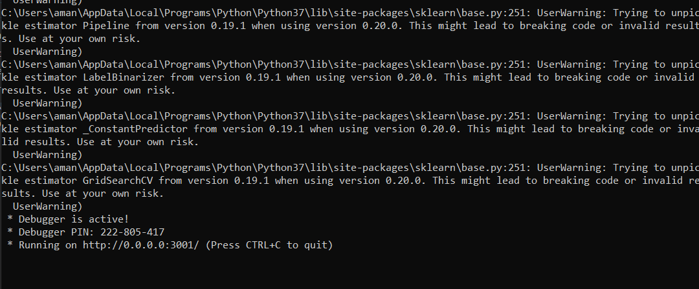
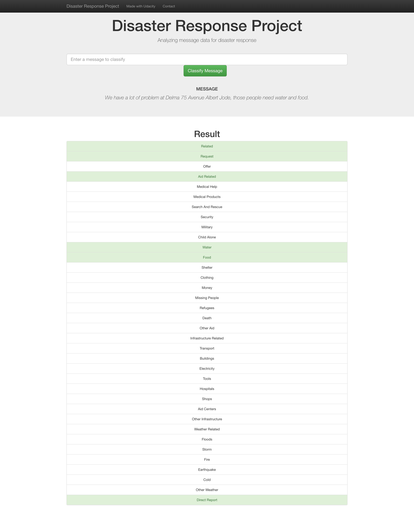
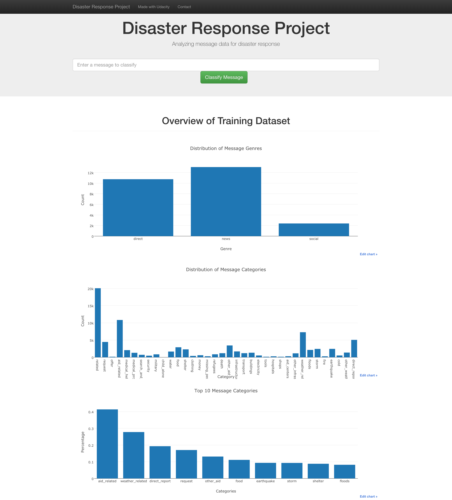
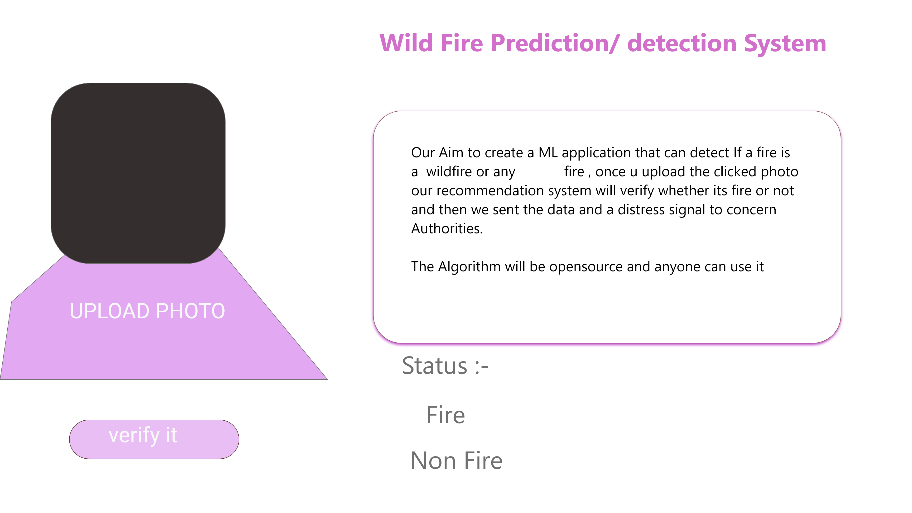

# Disaster Response Pipeline Project

## Table of Content

 1. [Objective and a short summary](#objective)
 2. [Whole Structure process](#setup) 
 3. [Running the file](#run)
 4. [Moving forward](#forward) 
     * (upcoming) what  can we do together 

## Objective 

This project aim to build a NLP model to categorize the message in a real time .
The dataset contained already labelled tewwts and messages from real disasters.
and also the project is a part of udacity datascience course .

This project is mainly compost of three parts :
 
 1. Processing part
    * load the data and categories the dataset
    * it also merge two dataset
    * and then stores in a SQLite database

2. Machile learning Pipeline 
    * load the data from the sqlite data 
    * splits it for training and testing and do respective jobs 
    * At last export the final model as a pickle model 

3. Running a web app which will predict the output.  

## Setup 

First lets see the structure of the file :-
.
    ├── app     
    │   ├── run.py                           # Flask file that runs app
    │   └── templates   
    │       ├── go.html                      # Classification result page of web app
    │       └── master.html                  # Main page of web app    
    ├── data                   
    │   ├── disaster_categories.csv          # Dataset including all the categories  
    │   ├── disaster_messages.csv            # Dataset including all the messages
    │   └── process_data.py                  # Data cleaning
    ├── models
    │   └── train_classifier.py              # Train ML model  
    |── Rough  
    |                              # Unneccesary file used for prototyping and rough work          
    └── README.md

## Objective 
 

1. Run the following commands in the project's root directory to set up your database and model.

    - To run ETL pipeline that cleans data and stores in database
        `python data/process_data.py data/disaster_messages.csv data/disaster_categories.csv data/DisasterResponse.db`
    - To run ML pipeline that trains classifier and saves
        `python models/train_classifier.py data/DisasterResponse.db models/classifier.pkl`

2. Run the following command in the app's directory to run your web app.
    `python run.py`

3. Go to http://0.0.0.0:3001/

* the output should look like this 

* the preview of my webpage

* the output will be like this

## Moving Forward

    * I am looking forward to create a project woth colabaration with somepeople.And also The image below is just my imagination
      ,I am open for suggestion and change

